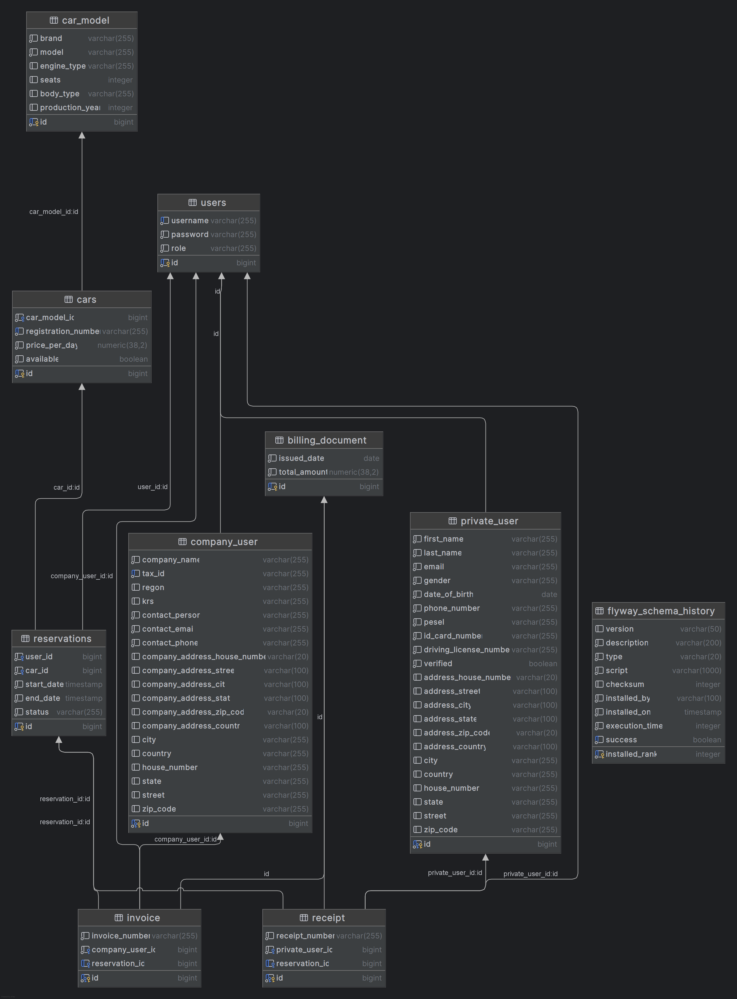
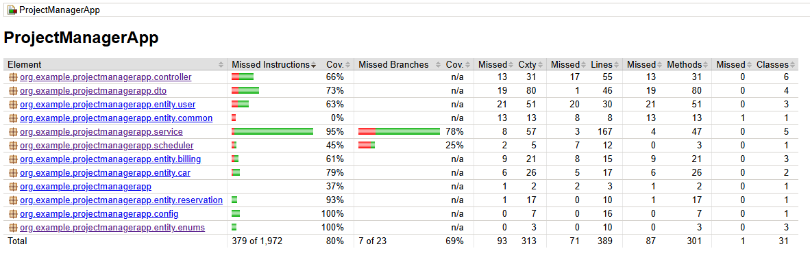

# ProjectManagerApp – Carsharing System

## 📌 Opis projektu

**ProjectManagerApp** to aplikacja webowa typu carsharing, umożliwiająca:
- rejestrację i logowanie użytkowników,
- przeglądanie i rezerwowanie dostępnych pojazdów,
- zarządzanie flotą aut przez administratora,
- generowanie faktur (dla firm) i paragonów (dla osób prywatnych),
- automatyczne zakończenia rezerwacji (scheduler).

Projekt został zrealizowany zgodnie z zasadami SOLID i paradygmatem obiektowym (OOP). Dane są przechowywane w bazie *PostgreSQL* i migrowane za pomocą *Flyway*.

---

## ⚙️ Technologie

- Java 21
- Maven
- Spring Boot 3.4
- Spring Security
- Spring Data JPA (Hibernate)
- PostgreSQL 15
- Flyway
- Docker & Docker Compose
- JUnit 5, Mockito
- JaCoCo
- OpenAPI / Swagger

---

## 🗃️ Struktura danych
Aplikacja wykorzystuje *Hibernate (ORM)* do mapowania obiektowo-relacyjnego oraz *PostgreSQL* jako system baz danych. Projekt posiada rozbudowany model dziedzinowy z podziałem na użytkowników, rezerwacje, pojazdy oraz dokumenty billingowe (faktury, paragony).

### 🔄 Schemat dziedziczenia:
#### 👥 Użytkownicy (User)
Klasa `User` jest klasą nadrzędną (abstrakcyjną) i dziedziczą w niej:
- `PrivateUser` – osoba fizyczna (PESEL, adres, prawo jazdy)
- `CompanyUser` – firma (NIP, REGON, adres, faktury)
Dziedziczenie zaimplementowano przy użyciu strategii *JOINED*, co tworzy osobne tabele w bazie dla każdej klasy.

#### 🚗 Samochody (Car)
- `CarModel` – definicja modelu samochodu (marka, typ nadwozia, rok itp.)
- `Car` – konkretny egzemplarz do wynajmu (z numerem rejestracyjnym, ceną i dostępnością)
Każdy `Car` posiada relację wiele-do-jednego z `CarModel`.

#### 📆 Rezerwacje (Reservation)
Encja `Reservation` zawiera:
- użytkownika (`User`)
- samochód (`Car`)
- daty startu i zakończenia
- status (`ReservationStatus`)
- opcjonalnie: `Invoice` lub `Receipt` (w zależności od typu użytkownika)

#### 💰 Dokumenty billingowe
Wspólna nadklasa: `BillingDocument` (**@Inheritance(JOINED)**)
- `Invoice` - wystawiana firmom (`CompanyUser`)
- `Receipt` - wystawiana osobom prywatnym (`PrivateUser`)
Każdy dokument związany jest z jedną rezerwacją.

#### 📍 Adres
Wspólna klasa `Address` (**@Embeddable**) jest wbudowana w `PrivateUser` oraz `CompanyUser` i zawiera:
- ulica, numer, miasto, kod pocztowy, kraj, itp.

---

## 🔐 Funkcjonalności

### Dla użytkownika (`ROLE_USER`)
- Rejestracja konta
- Przeglądanie dostępnych pojazdów
- Tworzenie i anulowanie rezerwacji
- Historia rezerwacji
- Otrzymywanie dokumentów (faktura / paragon)

### Dla administratora (`ROLE_ADMIN`)
- Zarządzanie flotą (dodawanie, edytowanie, usuwanie aut)
- Przegląd rezerwacji wszystkich użytkowników
- Ręczne kończenie rezerwacji

---

## 🌐 GitHub – wersjonowanie i współpraca
Projekt był zarządzany przy użyciu systemu kontroli wersji Git, a repozytorium zostało udostępnione na platformie GitHub. Poniżej znajdziesz informacje o strukturze repozytorium, pracy zdalnej oraz zasadach commitowania.

### 🔧 Dobre praktyki Git
#### ✅ Commit messages
W projekcie stosowano konwencję **Conventional Commits**, np.:
- feat: add car reservation endpoint
- chore: update dependencies in pom.xml
- itp.
#### 🌿 Branching model
Główny branch na którym jest postawiona cały projekt to: `project-system-carsharing`

---

## 🛠️ Flyway
Aplikacja wykorzystuje **Flyway** do zarządzania migracjami bazdy danych.
- Pliki migracyjne znajduje się w: `src/main/resources/db/migration`
- Przykładowa migracja: `V1__init.sql` (tworzy wszystkie wymagane tabele)

---

## 📊 Diagram ERD
Diagram ERD wygenerowany automatycznie przez *PostgeSQL*. Diagram przedstawia dokładnie jak zbudowana jest baza danych oraz jego połaczenia i klucze.


## 🧪 Testowanie

- Pokrycie testami integracyjnymi i jednostkowymi:
  - `CarServiceTest`, `UserControllerTest`, `ReservationControllerTest`, ...
- MockMvc + TestContainers + PostgreSQL
- JaCoCo: pokrycie 100% dla klas serwisowych i kontrolerów

Pokrycie JaCoCo w pliku *index.html*:


---

## 🐳 Uruchomienie przez Docker

Projekt został w pełni skonteneryzowany przy użyciu **Docker** i zarządzaby przez **Docker Compose**, co umożliwia szybkie uruchomienie całego środowiska aplikacji oraz bazy danych *PostgreSQL*

- Struktura plików **Docker**:
    ```bash
    /ProjectManagerApp
    ├── Dockerfile
    ├── docker-compose.yml
    ├── .dockerignore
    └── ...
- `docker-compose.yml` - Plik uruchamia dwa serwisy:
    - `projectmanager-app` - kontener z aplikacją *Spring Boot*
    - `projectmanager-db` - kontener z bazą danych *PostgreSQL*
- `application.properties` - Zawiera konfigurację połaczenia z bazą danych i Flyway:
    ```bash
    spring.application.name=ProjectManagerApp

    spring.datasource.url=${SPRING_DATASOURCE_URL}
    spring.datasource.username=${SPRING_DATASOURCE_USERNAME}
    spring.datasource.password=${SPRING_DATASOURCE_PASSWORD}

    spring.jpa.hibernate.ddl-auto=${SPRING_JPA_HIBERNATE_DDL_AUTO:validate} // można zmienić na none
    spring.jpa.show-sql=true

    spring.flyway.enabled=true
1. **Build projektu (bez testów)**:
   ```bash
   mvn clean install -DskipTests
2. **Build projektu (z testami)**:
   ```bash
   mvn clean install
3. **Uruchomienie Docker**:
    ```bash
    docker compose up --build
- Aplikacja dostępna będzie pod: 
    ```
    http://localhost:8080

    http://localhost:8080/swagger-ui/index.html#/

## 📄 Autor
Projekt wykonany przez `Oskar Świątek` w ramach *Programowanie Java - NST 2025*